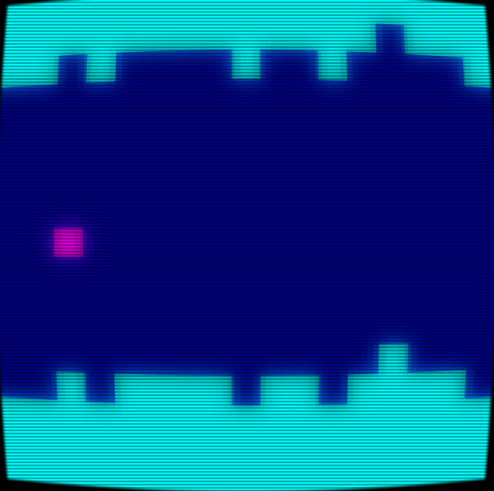

# bits

bits.lua is a strongly opinionated [Castle](https://www.castle.games) library intended for games of small character counts. For example, it may be used to make a game’s code fit within a tweet or two. (280 or 560 characters)

The documenation for the library is currently here in a Google Doc:

https://docs.google.com/document/d/17nfNStpj_OQJIXyGxlFVe_WOqAnKs_ZY3fP2Y79M2xI/edit?usp=sharing

Sorry, will add markdown in GitHub later :)

We're all just little squares at heart.



Below this sentence lies the code for the above game, which you may play here: [Submarine Adventure](https://castle.games/@schazers/submarine-adventure)

```lua
require 'bits'
TS,N,X,Y,c,p,e,F=1,17,2,9,5,.06,0,{}
function _L() 
  for i=1,N do F[i]={t=3,h=10} end 
end
function _D() 
  BG(GO and 11 or 7)
  for i=1,N do q=F[i] V(i,q.t,q.t+q.h,GO and 3 or 6) end
  A(4,Y,c)
  TEXT(GO and e or "",20,420,6,1)
end
function _U(dt)
  q=F[4]
  if not GO and Y>q.t and Y<q.t+q.h+0.5 then
  if T(1)>.395 then c=9 end
  if T(1)>.51715 then c=1 e=e+1 RT(1) end
  p=p-.0015*dt
  if T(2)>MAX(p,.033) then
    for i=1,N-1 do F[i]=F[i+1] end
    F[N]={t=CL(-2,F[N-1].t+RN(-1,1),N-3),h=CEIL(5+100*p)}
    RT(2)
  end
else DIE() c=1 end
end
```
